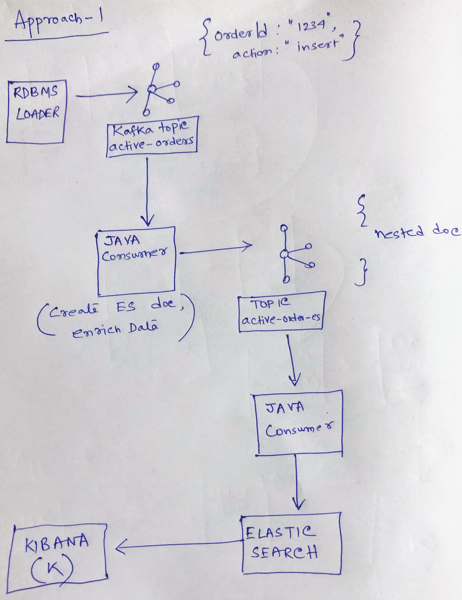

# kafka-elastic-search
Pull data from rdbms and push data to es using kafka topics/ connect

####Custom kafka consumer

####Using kafka connect

###Kafka Connect JDBC
cd ./connect
alias kconnect='${PATH_2_KAFKA}/bin/connect-standalone.sh ./worker.properties ./connect.properties'
